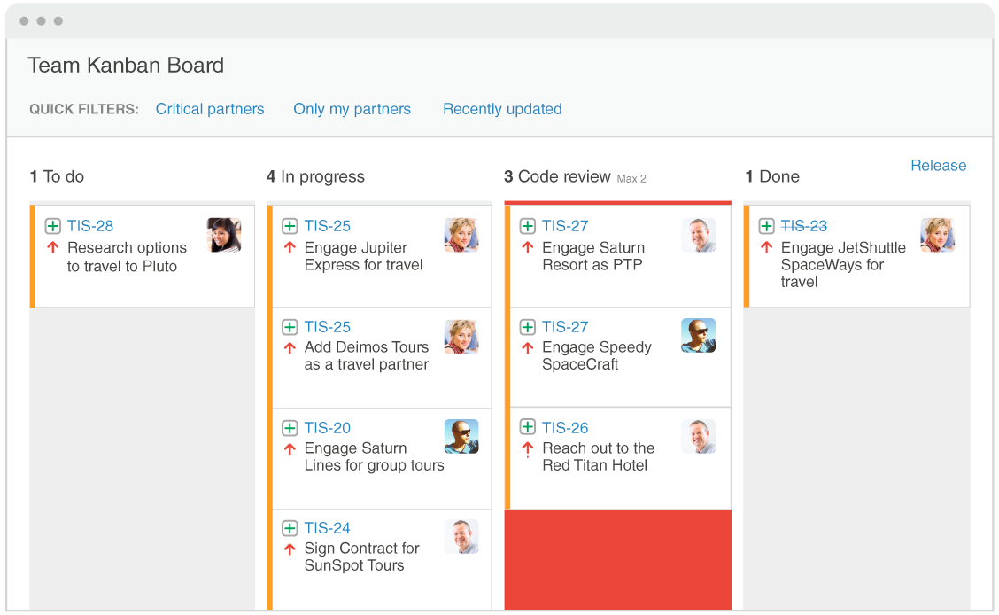

[Scrum Methodology](https://en.wikipedia.org/wiki/Scrum_(software_development))

[Implementing Scrum: The Classic Story of the Scrum Chicken and Pig Cartoon](https://www.implementingscrum.com/2006/09/11/the-classic-story-of-the-pig-and-chicken/)

[Scrum Master](http://whatis.techtarget.com/definition/scrum-master)

[Product Owner](https://www.mountaingoatsoftware.com/agile/scrum/roles/product-owner)

[Clean Code: A Handbook of Agile Software Craftsmanship (Robert C. Martin)](https://www.amazon.es/gp/aw/d/0132350882/ref=mp_s_a_1_1?__mk_es_ES=%C3%85M%C3%85Z%C3%95%C3%91&qid=1510158710&sr=8-1&pi=AC_SX236_SY340_FMwebp_QL65&keywords=clean+code&dpPl=1&dpID=41wGTnmRTFL&ref=plSrch)
