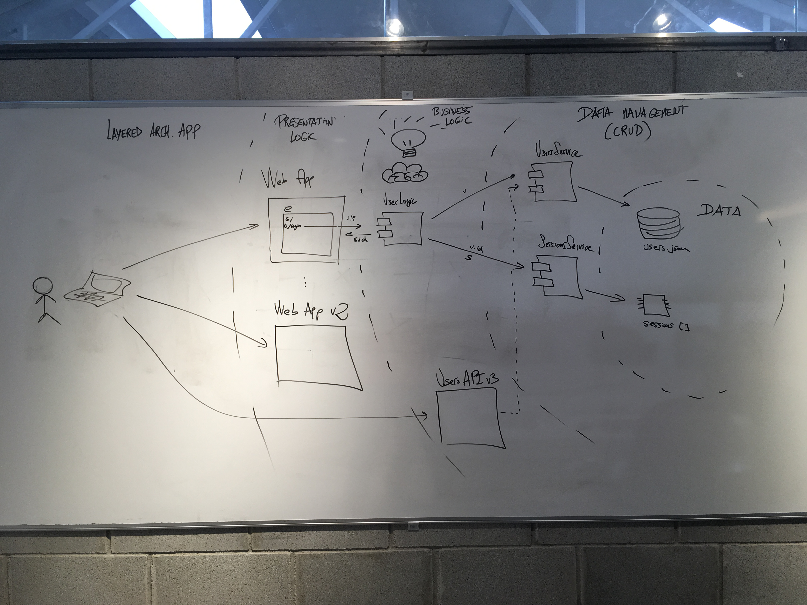
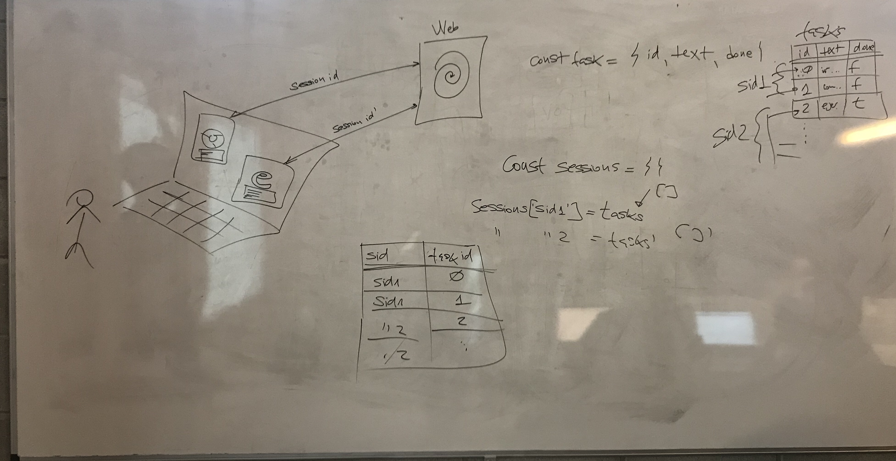

# [Express](https://expressjs.com)

## [Routing](https://expressjs.com/en/guide/routing.html)

## APIs

[Build a RESTful API Using Node and Express 4](https://scotch.io/tutorials/build-a-restful-api-using-node-and-express-4)

[Authenticate a Node.js API with JSON Web Tokens](https://scotch.io/tutorials/authenticate-a-node-js-api-with-json-web-tokens)

## [Pug](https://pugjs.org/api/getting-started.html)

[HTML 2 Pug](https://html2pug.herokuapp.com)

