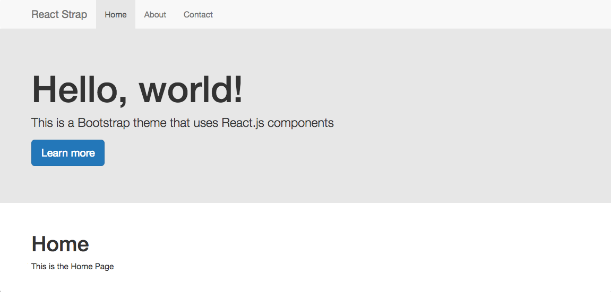
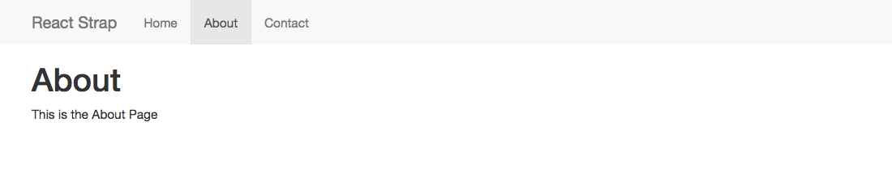

# Bootstrap Layout Components

_Note: For this exercise use the `index.html` you can find in the `material` folder_

## Step 1

Create the following layout using bootstrap and the following React components: `App`, `Navbar`, `Jumbotron`, `HomePage`

## Step 2

Replace the `HomePage` component by a `Page` component that receives a prop `currentPage` and shows different contents for pages: `home`, `about`, `contact`

_Note: test this by manually changing the prop_

## Step 3

Create a state for the `App` component that stores the current page. `Page` component should be updated w/ proper page when the state of App is updated

_Note: test this by changing the state using react tools_

## Step 4

Show the `Jumbotron` component only when currentPage is `home`

## Step 5

Add `click` events for the menu options and change currentPage accordingly,

Also show page selected by showing class `active` on proper menu option

