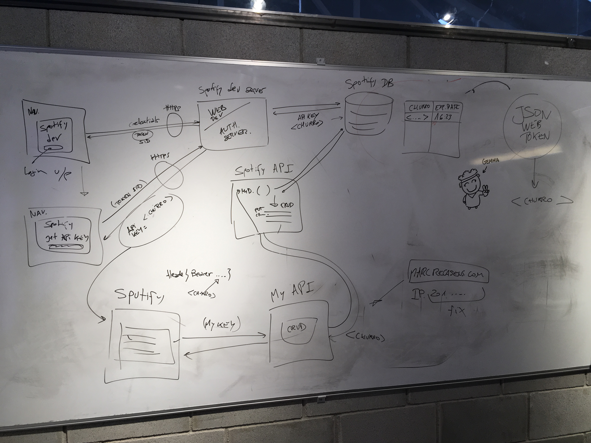

# References

[Designing a RESTful Web API](https://scotch.io/bar-talk/designing-a-restful-web-api)

[Public APIs](https://github.com/toddmotto/public-apis)

[The Anatomy of a JSON Web Token](https://scotch.io/tutorials/the-anatomy-of-a-json-web-token)

