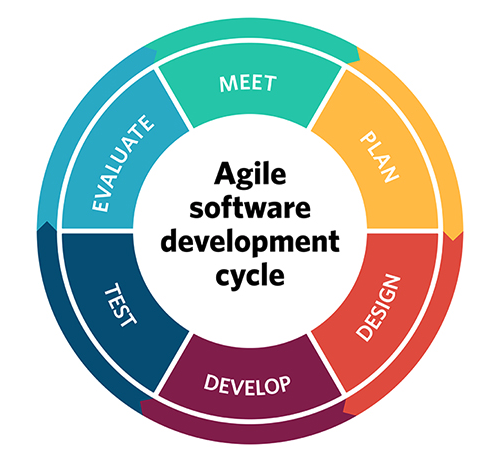

# Scrum

[Scrum Methodology](https://en.wikipedia.org/wiki/Scrum_(software_development))

[Product Owner](https://www.mountaingoatsoftware.com/agile/scrum/roles/product-owner)

[Scrum Master](http://whatis.techtarget.com/definition/scrum-master)

[Implementing Scrum: The Classic Story of the Scrum Chicken and Pig Cartoon](https://www.implementingscrum.com/2006/09/11/the-classic-story-of-the-pig-and-chicken/)

